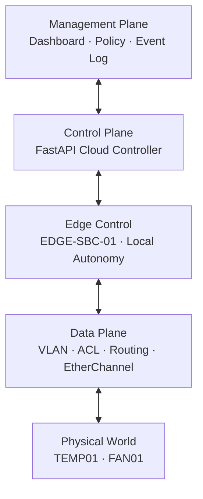
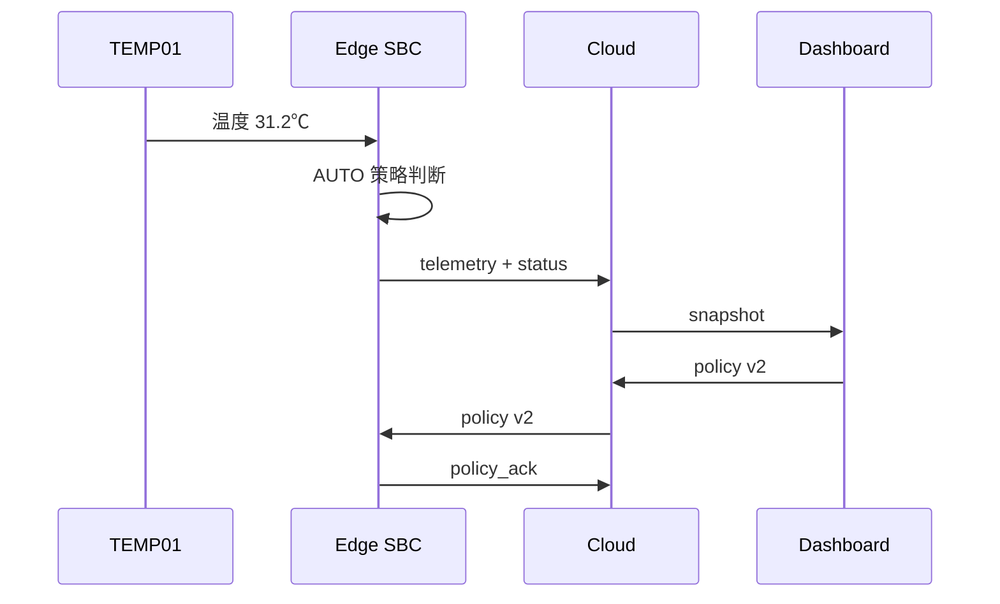

# 系统架构

## 一句话目标

在网络安全域隔离的基础上，实现“感知—边缘决策—云端管理—设备执行”的双向闭环，并在云端失联时保持本地自治。

## 三平面架构

## 双控制环

| 控制环 | 路径 | 职责 | 故障行为 |
|---|---|---|---|
| Edge Local Loop | TEMP01 → SBC → FAN01 | 毫秒/秒级本地判断 | 云端断开仍运行 |
| Cloud Global Loop | Dashboard → Backend → SBC | 策略、人工干预、汇聚 | 断开后显示降级，恢复时同步 |

Edge 优先保证安全控制；Cloud 不在每次设备动作的强依赖路径上。

## 状态所有权

| 状态 | 权威 Owner | 副本 |
|---|---|---|
| 当前温度、风扇实际状态 | Edge | Backend / Dashboard |
| 最后有效控制策略 | Edge | Backend / Dashboard |
| 待下发的新策略版本 | Backend | Dashboard |
| 事件展示 | Backend | Dashboard |
| VLAN、ACL、地址规划 | Network | 全组文档 |

## 关键运行序列

## 故障降级

Cloud WebSocket 断开时：

1. Edge 不清空策略，不关闭本地循环。
2. Edge 继续根据温度和迟滞区间控制风扇。
3. Edge 定时重连，不阻塞传感器循环。
4. 重连后发送 `hello` 和 `state_sync`，恢复云端视图。

## 首版非目标

- 不做多租户、用户认证和公网发布。
- 不做真实生产级高可用或持久化数据库。
- 不在 Gate 5 前加入烟雾、门禁等第二场景。
- 不把 Dashboard 的视觉效果包装为系统核心创新。
