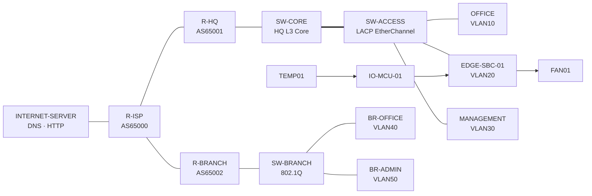

# 系统架构 — Final Architecture v2

## 一句话目标

在多园区网络安全域隔离的基础上，实现“感知—边缘决策—云端管理—设备执行”的双向闭环；总部、Internet 与异地分部通过分层路由和安全策略互联，同时在 Cloud 失联时保持本地 Edge 自治。

## 设计演进原则

Final Architecture v2 是对 Gate 1 单园区基线的**向外扩展**，不是重构。

必须保留：

- HQ VLAN 10 / 20 / 30、地址和 ACL 意图；
- SW-CORE ⇄ SW-ACCESS 的 LACP EtherChannel；
- TEMP01 → MCU → EDGE-SBC-01 → FAN01 本地闭环；
- Protocol v1.0、设备 ID、WS 路径；
- RealWSClient 到真实 FastAPI 的带外控制方式。

新增：R-HQ、R-ISP、R-BRANCH、SW-BRANCH、BR-OFFICE-PC、BR-ADMIN-PC、INTERNET-SERVER，以及相应的 OSPF/eBGP、NAT、DNS/HTTP、IPv6 Overlay 与 Port Security。

## 总体拓扑



网络控制关系：

```text
HQ Core --OSPF Area 0-- R-HQ --eBGP-- R-ISP --eBGP-- R-BRANCH
                                                   |
                                            Router-on-a-Stick
                                                   |
                                              SW-BRANCH
```

跨站点 IPv6：

```text
HQ IPv6 LANs
     ↓
   R-HQ ===== IPv6-over-IPv4 Tunnel ===== R-BRANCH
                                               ↓
                                        Branch IPv6 LANs

ISP Underlay: IPv4-only
```

## 四层系统视图

| 层 | 组件 | 主要职责 |
|---|---|---|
| Physical World | TEMP01、FAN01 | 环境感知与物理执行 |
| Edge Layer | IO-MCU-01、EDGE-SBC-01 | 本地策略、迟滞控制、Telemetry、重连 |
| Campus & WAN Data Plane | VLAN、ACL、EtherChannel、OSPF、BGP、NAT、Tunnel、Port Security | 安全互联、业务承载、课程组网能力 |
| Cloud & Management Plane | FastAPI、Dashboard、Event Log | 状态汇聚、策略下发、人工控制、可观测 |

## 双控制环

| 控制环 | 路径 | 职责 | 故障行为 |
|---|---|---|---|
| Edge Local Loop | TEMP01 → MCU → SBC → FAN01 | 本地实时温控 | Cloud 断开仍运行最后有效策略 |
| Cloud Global Loop | Dashboard → FastAPI → SBC | Policy、Command、状态汇聚 | 断开后管理能力降级，恢复后 State Sync |

Edge 优先保证安全控制；Cloud 不位于每次设备动作的强依赖路径。

## 六条核心业务流

### 1. Edge Local Loop

```text
TEMP01 → IO-MCU-01 → EDGE-SBC-01 → FAN01
```

核心创新：断云不断控。

### 2. Cloud Control Loop

```text
EDGE-SBC-01 ↔ RealWSClient ↔ FastAPI ↔ Dashboard
```

用于真实 Telemetry、Policy、Command、ACK、Heartbeat 和 State Sync。

### 3. Branch Business Flow

```text
BR-OFFICE-PC
  → VLAN40
  → R-BRANCH
  → eBGP / ISP
  → R-HQ
  → HQ Core
  → HQ-SERVICE (BACKEND-STUB)
```

分部普通员工只能访问总部允许的业务服务，不拥有 HQ IoT 或管理权限。

### 4. Remote Operations Flow

```text
BR-ADMIN-PC
  → VLAN50 IPv6
  → R-BRANCH
  → IPv6-over-IPv4 Tunnel
  → R-HQ
  → HQ MANAGEMENT
  → HQ-SERVICE
```

业务含义：运营商只提供 IPv4 Underlay，企业通过 IPv6 Overlay 维持跨站点管理网络。

### 5. Central Administration Flow

```text
HQ ADMIN-PC
  → HQ MANAGEMENT
  → R-HQ
  → Enterprise WAN
  → R-BRANCH / SW-BRANCH
```

总部 NOC 统一管理异地网络设备；普通 OFFICE 终端不能执行网络设备远程管理。

### 6. Enterprise Internet Flow

```text
HQ OFFICE
  → SW-CORE
  → R-HQ
  → PAT
  → R-ISP
  → INTERNET-SERVER (DNS / HTTP)
```

同时保留静态 TCP/80 映射作为实验三的服务发布验收：Internet 测试节点可通过 R-HQ 公网地址访问 HQ-SERVICE 的模拟 HTTP 页面。该服务仅是 Packet Tracer 数据平面验证，不代表真实 FastAPI 对公网发布。

## HQ 与 Branch 的设计差异

| 站点 | 规模假设 | VLAN 间路由方式 | 理由 |
|---|---|---|---|
| HQ | 大型园区 | 3650 SVI 三层交换 | 高性能、集中核心 |
| Branch | 小型分部 | R-BRANCH Router-on-a-Stick | 设备少、成本低、结构清晰 |

两种方案同时存在不是重复，而是根据站点规模选择不同网络设计。

## 路由分层

### IPv4

- HQ 内部：OSPF Area 0，仅 SW-CORE ↔ R-HQ。
- WAN：eBGP，R-HQ AS65001、R-ISP AS65000、R-BRANCH AS65002。
- SW-CORE 不学习完整 BGP 表；R-HQ 向 HQ OSPF 发布默认路由，保持 Core 简洁。
- R-HQ 通过 BGP 学习 Branch / Internet 路由，并使用 HQ OSPF 路由作为 BGP 发布依据。

### IPv6

- ISP 保持 IPv4-only。
- HQ / Branch 内部使用 IPv6。
- R-HQ ↔ R-BRANCH 使用 IPv6-over-IPv4 Tunnel。
- 跨站点 IPv6 使用静态 IPv6 路由，不再引入 OSPFv3，避免不必要复杂度并保留课程中的静态 IPv6 路由能力。

## 状态所有权

| 状态 | 权威 Owner | 副本 |
|---|---|---|
| 当前温度、风扇实际状态 | Edge | Backend / Dashboard |
| 最后有效控制策略 | Edge | Backend / Dashboard |
| 待下发策略版本 | Backend | Dashboard |
| 事件展示 | Backend | Dashboard |
| HQ/Branch VLAN、WAN 地址、路由与 ACL | Network | 文档 / 设备配置 |
| Final canonical `.pkt` | A Network | GitHub main 归档 |

## 安全域与权限意图

| Source | HQ-SERVICE | HQ IOT | HQ MANAGEMENT | Branch Devices | Internet |
|---|---:|---:|---:|---:|---:|
| HQ OFFICE | 受控允许 | 拒绝 | 拒绝/有限 | 默认拒绝 | 允许经 PAT |
| HQ ADMIN | 允许 | 允许 | 允许 | 允许管理 | 允许 |
| HQ IOT | 必要服务 | 本地 | 必要控制 | 拒绝 | 默认拒绝 |
| BR-OFFICE | 仅业务服务 | 拒绝 | 拒绝 | 无管理权 | 可选 |
| BR-ADMIN | 允许 | 默认拒绝 | 允许经管理 Overlay | 允许 | 可选 |

具体 ACL 命令以 Packet Tracer 9.0.1 实测为准，但上述安全意图是 Final Architecture v2 的冻结要求。

## 真实 Cloud 与 Packet Tracer WAN 的边界

必须区分：

```text
Packet Tracer Data Plane
VLAN / ACL / OSPF / BGP / NAT / IPv6 Tunnel
```

和：

```text
Out-of-band Edge–Cloud Channel
EDGE-SBC-01 → RealWSClient → 127.0.0.1:8000 → Real FastAPI
```

真实 WebSocket **不经过** R-HQ / R-ISP / BGP / NAT / IPv6 Tunnel。`BACKEND-STUB` / HQ-SERVICE 只证明 PT 网络可以承载相应类型的业务访问。

## Cloud 故障降级

Cloud WebSocket 断开时：

1. Edge 不清空 Policy，不停止本地循环。
2. Edge 继续根据温度和迟滞规则控制 FAN01。
3. Edge 定时重连，但重连逻辑不得阻塞传感器循环。
4. Dashboard 明确显示失联。
5. 重连后 Edge 发送 `hello` + `state_sync`，恢复真实温度、Fan 与 Policy Version。

## 非目标

- 不增加第二套烟雾/门禁 IoT 场景。
- 不增加 Kubernetes、MQ、数据库、微服务或多租户。
- 不把模拟 WAN 宣称为真实 Internet。
- 不把真实 FastAPI WebSocket 宣称为经过 Packet Tracer 网络。
- 不在 Gate 5 前增加与前五次实验覆盖、核心业务流无关的设备。
- Dashboard 视觉包装不是核心创新，正确状态与可解释事件优先。

## NOC Upgrade — IMPLEMENTED / LOCAL VERIFIED

用户授权在最新本地 feat/edge 上进行 NOC 增量开发，三段完成 Network Health、Security Center、Remote Operations/Campus Policy/Failure Simulation。独立 NetworkProvider/mock adapter 与 REST API，不修改 Protocol 1.0、Edge Policy/ACK 或 canonical .pkt。当前 Gate4 与 Gate5 状态保持；详见 `docs/NOC_UPGRADE.md`。

NOC 五功能已完成并通过本地 HTTP/WS/浏览器验证；详细接口、模拟边界和六步演示见 [NOC_UPGRADE.md](NOC_UPGRADE.md)。此结果不改变 Gate4 证据待补状态。
