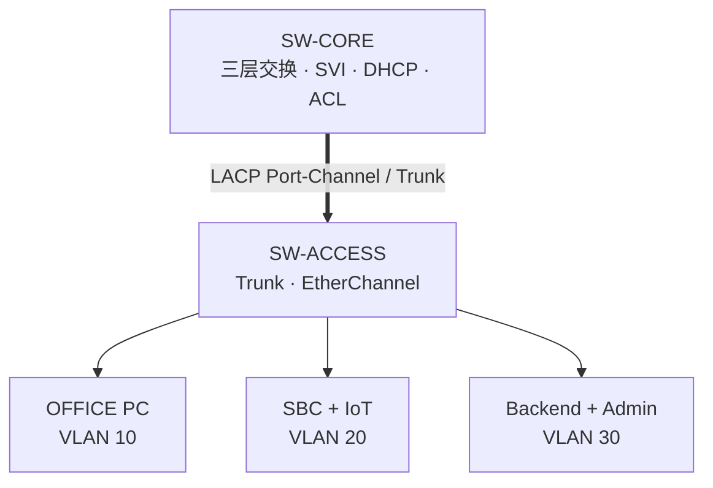

# 网络规划（Network Owner）

## 固定逻辑规划

| 安全域 | VLAN | 网段 | 网关 | 关键节点 | 策略 |
|---|---:|---|---|---|---|
| OFFICE | 10 | `192.168.10.0/24` | `192.168.10.1` | 办公 PC：DHCP | 可访问 Dashboard，不可直控 IoT |
| IOT | 20 | `192.168.20.0/24` | `192.168.20.1` | `EDGE-SBC-01 = 192.168.20.10` | 仅向控制平面发起必要连接 |
| MANAGEMENT | 30 | `192.168.30.0/24` | `192.168.30.1` | Backend：`192.168.30.10`；Admin：`.20` | 管理访问与控制服务 |

DNS 非核心，首版可直接使用 IP。默认 Dashboard/WS 端口为 TCP 8000。

## 推荐最小拓扑

设备实际型号和可用端口以实验室 Packet Tracer 环境为准。A 在创建 `.pkt` 后，把端口映射补入下表并提交；端口映射未冻结前，其他人不得假设物理接口名。

| 链路 | A 端接口 | B 端接口 | 模式 | 状态 |
|---|---|---|---|---|
| SW-CORE ↔ SW-ACCESS #1 | `TODO` | `TODO` | LACP trunk | TODO |
| SW-CORE ↔ SW-ACCESS #2 | `TODO` | `TODO` | LACP trunk | TODO |
| OFFICE PC | `TODO` | PC NIC | access VLAN 10 | TODO |
| EDGE-SBC-01 | `TODO` | SBC NIC | access VLAN 20 | TODO |
| Backend | `TODO` | Server NIC | access VLAN 30 | TODO |

## 网络功能清单

- 创建并命名 VLAN 10/20/30。
- Access 端口划入对应 VLAN。
- 两条交换链路使用 LACP EtherChannel，Port-Channel 配置 trunk 并仅允许 10/20/30。
- Core 创建三个 SVI 并开启三层转发。
- OFFICE 使用 DHCP；IOT 与 MANAGEMENT 核心节点静态地址。
- ACL 必须让网络策略真实影响系统，而不是只用于截图。

## ACL 意图

1. OFFICE → Backend TCP/8000：允许。
2. OFFICE → IOT 全网段：拒绝。
3. IOT → Backend TCP/8000：允许。
4. IOT → OFFICE：拒绝。
5. MANAGEMENT → OFFICE/IOT：允许（用于运维）。
6. 其余流量按老师验收要求决定，变更需记录。

命令级 ACL 在明确交换机型号、IOS 能力和放置方向后补入 `packet_tracer/CONFIG_LOG.md`，避免初始仓库给出与实际设备不兼容的接口命令。

## Gate 0 必须补齐

- 设备型号与端口映射。
- Backend 是 PT Server 还是通过真实主机桥接；若为真实主机，明确 PT 可达方式。
- 所有网卡实际地址、默认网关。
- ACL 应用的接口和方向。
- 现场环境重开后地址是否稳定。
