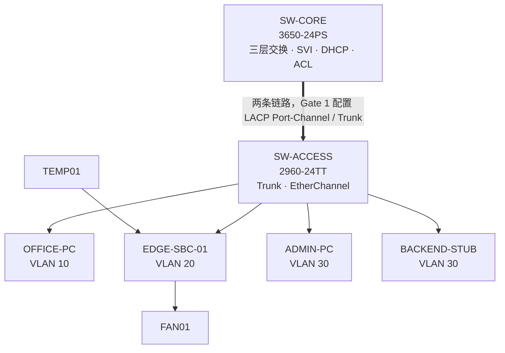

# 网络规划（Network Owner）

## 固定逻辑规划

| 安全域 | VLAN | 网段 | 网关 | 关键节点 | 策略 |
|---|---:|---|---|---|---|
| OFFICE | 10 | `192.168.10.0/24` | `192.168.10.1` | `OFFICE-PC`：DHCP | 可访问管理平台，不可直控 IoT |
| IOT | 20 | `192.168.20.0/24` | `192.168.20.1` | `EDGE-SBC-01 = 192.168.20.10` | IoT 安全域，仅允许必要业务 |
| MANAGEMENT | 30 | `192.168.30.0/24` | `192.168.30.1` | `BACKEND-STUB = 192.168.30.10`；`ADMIN-PC = 192.168.30.20` | 管理访问与控制服务 |

DNS 非核心，首版可直接使用 IP。逻辑上的 Dashboard/WS 服务端口统一为 TCP 8000。

> `BACKEND-STUB` 是 Packet Tracer 内 MANAGEMENT 域的网络验收节点，不是真实 FastAPI Control Plane。真实 Backend 与 Packet Tracer 运行在同一台物理主机上，Edge 通过 Packet Tracer External Network Access / `RealWSClient` 建立带外控制通道。

## Gate 0 冻结的设备与最小拓扑

- `SW-CORE`：Cisco 3650-24PS
- `SW-ACCESS`：Cisco 2960-24TT
- `OFFICE-PC`：PC-PT
- `EDGE-SBC-01`：SBC-PT，已安装 FastEthernet 模块
- `ADMIN-PC`：PC-PT
- `BACKEND-STUB`：Server-PT
- `TEMP01`：Temperature Sensor
- `FAN01`：Fan



## 已冻结端口映射

| 链路 | A 端接口 | B 端接口 | 规划模式 | Gate 0 状态 |
|---|---|---|---|---|
| SW-CORE ↔ SW-ACCESS #1 | `SW-CORE Gi1/0/1` | `SW-ACCESS Gi0/1` | LACP trunk | VERIFIED |
| SW-CORE ↔ SW-ACCESS #2 | `SW-CORE Gi1/0/2` | `SW-ACCESS Gi0/2` | LACP trunk | VERIFIED |
| OFFICE-PC | `SW-ACCESS Fa0/1` | PC NIC | access VLAN 10 | VERIFIED |
| EDGE-SBC-01 | `SW-ACCESS Fa0/2` | SBC FastEthernet0 | access VLAN 20 | VERIFIED |
| ADMIN-PC | `SW-ACCESS Fa0/3` | PC NIC | access VLAN 30 | VERIFIED |
| BACKEND-STUB | `SW-ACCESS Fa0/4` | Server NIC | access VLAN 30 | VERIFIED |

Gate 0 已通过 `show interfaces status` 对实际接口进行确认。两条 Core–Access 并行链路在 Gate 1 配置 EtherChannel 前由 STP 阻塞其中一条属于预期现象。

## Packet Tracer 数据平面与真实控制平面

项目明确区分两条路径。

### 1. Packet Tracer 模拟数据平面

```text
OFFICE / IOT / MANAGEMENT
        ↓
VLAN + SVI + ACL + Routing + EtherChannel
```

该平面用于验证课程要求中的二层/三层组网、安全域隔离和访问控制。

### 2. Edge–Cloud 带外控制通道

```text
EDGE-SBC-01
    ↓  Packet Tracer RealWSClient
ws://127.0.0.1:8000/ws/edge
    ↓
Real FastAPI Backend
```

该链路已在 Gate 0 实机验证：

- SBC 输出 `CONNECTED`；
- 远端显示 `127.0.0.1 8000`；
- Uvicorn 日志出现 `edge connected`；
- `/api/state` 返回 `edge_online=true`、`cloud_state=CONNECTED`；
- 保存、关闭并重新打开 `.pkt` 后复测仍可连接。

因此，后续文档不得描述为“真实 WebSocket 流量经过 VLAN 20/30”。首版应准确表述为：**Packet Tracer 模拟园区数据平面，External Network Access 提供 Edge 到真实 Control Plane 的带外控制通道。**

## 网络功能清单（Gate 1 实施）

- 创建并命名 VLAN 10/20/30。
- Access 端口划入对应 VLAN。
- 两条交换链路使用 LACP EtherChannel，Port-Channel 配置 trunk 并仅允许 10/20/30。
- Core 创建三个 SVI 并开启三层转发。
- OFFICE 使用 DHCP；IOT 与 MANAGEMENT 核心节点静态地址。
- ACL 必须让网络策略真实影响系统，而不是只用于截图。

## ACL 意图与冻结的放置原则

1. OFFICE → 管理平台 TCP/8000：允许。
2. OFFICE → IOT 全网段：拒绝。
3. IOT → MANAGEMENT 中必要管理服务：允许。
4. IOT → OFFICE：拒绝。
5. MANAGEMENT → OFFICE/IOT：允许（用于运维）。
6. 其余流量按老师验收要求决定，变更需记录。

ACL 首版采用“按源安全域在进入三层核心时即进行策略判定”的原则：

- `interface vlan 10`：inbound ACL；
- `interface vlan 20`：inbound ACL；
- `interface vlan 30`：首版不配置限制性 ACL，作为最高信任管理域。

具体 Cisco ACL 命令在 Gate 1 根据 3650 的实际 IOS 能力写入 `packet_tracer/CONFIG_LOG.md`。

## Gate 0 结论

以下公共网络契约已冻结：

- 设备型号与物理端口映射：DONE；
- VLAN/IP/默认网关规划：DONE；
- `BACKEND-STUB` 与真实 Backend 的职责边界：DONE；
- PT → 真实主机控制通道：VERIFIED；
- ACL 放置接口和方向原则：DONE；
- 保存并重开 Packet Tracer 后连接可重复：VERIFIED。

**Gate 0 网络部分 COMPLETE。后续公共项变更必须按 RFC 流程处理。**
