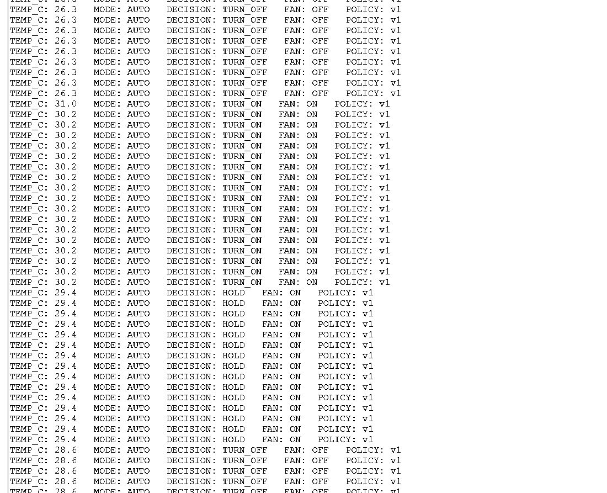

# Gate 1 — B Edge Owner 阶段实验报告

## 1. 实验目的

本阶段负责 EdgeCampus 的 B（Edge Owner）模块，在 Cisco Packet Tracer 9.0.1 中实现一个不依赖 Cloud 才能运行的本地温控闭环。

目标不是在 Gate 1 完成全部云端联调，而是先把真实 Packet Tracer 内的感知、边缘决策与执行链路跑通，并把实际可用 API、pin、接线方式和调试过程记录下来，为 Gate 2/3 的协议接入和最终总报告提供可复现依据。

本阶段目标链路：

```text
TEMP01
  -> IO-MCU-01
  -> EDGE-SBC-01
  -> FAN01
```

其中：

- MCU 负责温度传感器模拟量采集和温度换算；
- MCU 通过 USB 将温度发送给 SBC；
- SBC 维护本地 AUTO 策略状态；
- SBC 使用迟滞控制决定 FAN01 的 ON/OFF；
- 本地控制决策不依赖 Backend。

---

## 2. 实验环境

- 软件：Cisco Packet Tracer **9.0.1**
- 温度传感器：`TEMP01`
- MCU：`IO-MCU-01`
- Edge SBC：`EDGE-SBC-01`
- 执行器：`FAN01`
- Edge 编程环境：Packet Tracer Python 3 Project
- 策略版本：`policy_version = 1`

项目固定策略参数：

```text
mode = AUTO
threshold_c = 30.0
hysteresis_c = 1.0
policy_version = 1
fan_state = OFF / ON
```

---

## 3. 硬件连接与模块划分

### 3.1 TEMP01 -> MCU

连接：

```text
TEMP01 A0 -> IO-MCU-01 A0
```

MCU 使用：

```python
analogRead(A0)
```

读取模拟值。

### 3.2 MCU -> SBC

连接：

```text
IO-MCU-01 USB0 -> EDGE-SBC-01 USB0
```

两端统一：

```python
USB(0, 9600)
```

MCU 使用 `write()` 发送温度字符串，并添加 `\n`；SBC 使用 `inWaiting()` + `readLine()` 读取完整一行。

### 3.3 SBC -> FAN01

连接：

```text
EDGE-SBC-01 D0 -> FAN01 D0
```

使用 Packet Tracer **Custom Cable**。

FAN01 Data Specifications：

```text
state = 0 -> OFF
state = 1 -> LOW
state = 2 -> HIGH
```

项目公共状态使用 `ON/OFF`，因此本阶段 PT 适配为：

```text
OFF -> 0
ON  -> 2
```

也就是本地策略只决定是否开启，而 Packet Tracer 适配层将 ON 映射到 FAN01 High Speed。

---

## 4. 阶段一：验证温度采集

### 4.1 初始程序

MCU 通过 `analogRead(A0)` 获取 `0~1023` 的模拟读数，并按 TEMP01 的范围映射为 `-100 C ~ 100 C`：

```python
temp_c = raw * 200.0 / 1023.0 - 100.0
```

输出：

```text
RAW: <raw>   TEMP_C: <temperature>
```

### 4.2 初始现象

测试初期 `TEMP_C` 长时间接近 `-0.5 C`，因此首先怀疑：

- 传感器 A0 接线错误；
- MCU 读取接口错误；
- 温度映射不正确；
- Packet Tracer 环境温度没有真正变化。

随后直接修改 TEMP01 的环境温度，发现 `analogRead(A0)` 原始值和 `TEMP_C` 都会随之变化。

因此确认：

```text
TEMP01 A0 -> MCU A0 -> analogRead(A0)
```

工作正常。

### 4.3 阶段结论

温度采集链路通过。

---

## 5. 阶段二：独立验证 FAN01 控制

为了避免完整闭环中同时出现多个故障源，先完全绕过温度采集和 USB 通信，仅验证：

```text
EDGE-SBC-01 -> FAN01
```

测试程序反复执行：

```python
customWrite(0, "0")
customWrite(0, "1")
customWrite(0, "2")
```

### 5.1 遇到的问题

初始测试时 SBC Console 可以正常打印程序输出，但是：

```text
FAN01 -> Attributes -> state
```

始终保持 `0`。

这说明 Python 程序本身确实在执行，但控制数据没有正确到达 FAN01。

### 5.2 排查方法

将问题限制在三个可能点：

1. `customWrite()` pin 编号；
2. SBC D0 与 FAN D0 的实际连接；
3. 是否使用正确的 Custom Cable。

重新核对 D0 pin、Custom Cable 和 `customWrite(0, "...")` 后，FAN01 state 可以正常改变。

### 5.3 阶段结论

SBC -> FAN 执行器链路通过。

---

## 6. 阶段三：MCU -> SBC USB 通信

在两端硬件链路分别通过后，增加中间的数据通道。

MCU 发送：

```python
usb.write(temp_str + "\n")
```

SBC 接收：

```python
if usb.inWaiting() > 0:
    data = usb.readLine()
```

测试时 SBC Console 能持续看到：

```text
SBC received TEMP_C: xx.x
```

并且 TEMP01 环境温度变化时，SBC 接收值同步变化。

因此：

```text
TEMP01 -> MCU -> USB -> SBC
```

通信链路通过。

---

## 7. 阶段四：实现正式 AUTO 迟滞控制

Gate 1 不采用简单的“低于阈值关、高于阈值开”单阈值逻辑，而使用项目冻结的迟滞策略：

```text
threshold_c = 30.0 C
hysteresis_c = 1.0 C
```

正式规则：

```text
temperature >= 30.0 C
    -> FAN ON

temperature <= 29.0 C
    -> FAN OFF

29.0 C < temperature < 30.0 C
    -> 保持上一 fan_state
```

伪代码：

```python
if temperature_c >= threshold_c:
    fan_state = "ON"
elif temperature_c <= threshold_c - hysteresis_c:
    fan_state = "OFF"
# else: keep previous state
```

迟滞区间可以避免温度在阈值附近发生微小波动时，风扇不断 ON/OFF 抖动。

---

## 8. 最终程序结构

### 8.1 MCU

文件：

```text
edge/packet_tracer/mcu_temperature_sender.py
```

职责：

```text
TEMP01 analog input
    -> analogRead(A0)
    -> temperature conversion
    -> USB0 text framing
    -> SBC
```

MCU 不负责温控决策。

### 8.2 SBC

文件：

```text
edge/packet_tracer/sbc_local_controller.py
```

职责：

```text
USB temperature
    -> local AUTO policy
    -> hysteresis decision
    -> fan_state
    -> customWrite()
    -> FAN01
```

这样把“采集”和“边缘决策”分开，后续接入 Cloud 时也不会破坏本地控制环。

---

## 9. Gate 1 实测结果

最终测试按照“先低温、再跨上阈值、再回到迟滞区间、最后低于关闭阈值”的顺序进行。

实际截图中可观察到：

### 9.1 低温状态

```text
TEMP_C: 27.9 / 27.1 / 26.3
DECISION: TURN_OFF
FAN: OFF
```

说明低于关闭阈值时 FAN 保持关闭。

### 9.2 跨越上阈值

实际出现：

```text
TEMP_C: 31.0
DECISION: TURN_ON
FAN: ON
```

随后：

```text
TEMP_C: 30.2
DECISION: TURN_ON
FAN: ON
```

说明温度达到或超过 `30.0 C` 后 FAN 正确开启。

### 9.3 迟滞区间保持

随后把温度降低到：

```text
TEMP_C: 29.4
DECISION: HOLD
FAN: ON
```

此时温度已经低于 30 C，但因为仍高于 29 C，系统没有立即关风扇，而是保留之前的 ON 状态。

这是本阶段迟滞控制成功的核心证据。

### 9.4 低于关闭阈值

继续降低温度，实际出现：

```text
TEMP_C: 28.6
DECISION: TURN_OFF
FAN: OFF
```

说明跨过 `threshold - hysteresis = 29.0 C` 后，系统正确关闭 FAN。

### 9.5 测试结论

完整状态序列：

```text
低温
27.x C
FAN OFF
   |
   v
跨上阈值
31.0 C
FAN ON
   |
   v
回落到迟滞区间
29.4 C
HOLD -> FAN ON
   |
   v
低于关闭阈值
28.6 C
FAN OFF
```

AUTO + hysteresis 控制逻辑通过。

---

## 10. 实验证据

### 图 B1 — SBC 迟滞控制 Console

文件：

```text
edge/packet_tracer/evidence/B1_hysteresis_console.png
```

该图在同一 Console 中完整记录：

- `27.x C -> FAN OFF`
- `31.0/30.2 C -> FAN ON`
- `29.4 C -> HOLD + FAN ON`
- `28.6 C -> FAN OFF`



### 图 B2 — FAN state 与拓扑

文件：

```text
edge/packet_tracer/evidence/B2_fan_state_topology.png
```

图中 FAN01 `Attributes -> state = 2`，同时可以看到：

```text
TEMP01 -> IO-MCU-01 -> EDGE-SBC-01 -> FAN01
```

的现场 Packet Tracer 拓扑。


---

## 11. 为什么采用逐段验证

本阶段没有直接把完整系统一次性写完，而是按以下顺序排查：

```text
1. TEMP -> MCU
2. SBC -> FAN
3. MCU -> SBC
4. 完整 closed loop
5. hysteresis
```

这种做法有两个优势：

第一，每次只有一个新的变量。一旦测试失败，可以立即缩小问题范围。

第二，每一段都形成独立可验收证据，最终总报告可以明确说明“感知、通信、决策、执行”分别如何工作，而不是只给出一张最终运行截图。

这次 FAN state 不变化的问题也证明了这种方法的必要性：如果一开始就运行完整温控程序，很容易误以为错误发生在温度条件判断，而实际上问题位于 SBC -> FAN 的执行链路。

---

## 12. 本地自治与 Cloud 边界

当前 Gate 1 SBC 控制循环的输入只有：

```text
MCU USB temperature
```

输出只有：

```text
FAN01 customWrite()
```

本地 AUTO 决策路径中没有 Backend 请求，因此 Cloud/WebSocket 不可用不会阻止本地温控循环执行。

Gate 0 已单独验证真实 `RealWSClient -> FastAPI` 能力。后续 Gate 会把本地状态映射为协议消息并增加 Cloud 状态同步，但 Cloud 不应成为 AUTO 控制链路的单点依赖。

> 证据管理说明：当前两张截图已经证明本地闭环和迟滞逻辑。若 Gate 1 最终验收要求“同时显示 Backend 进程明确关闭”，再补充一张 Backend 未运行状态与 PT 本地控制并存的截图即可，不需要修改本地控制代码。

---

## 13. Gate 1 B 验收表

| 验收项 | 实测结果 |
|---|---|
| TEMP01 模拟温度读取 | PASS |
| MCU 原始值 -> 摄氏温度换算 | PASS |
| MCU -> SBC USB 数据传输 | PASS |
| SBC -> FAN01 `customWrite()` | PASS |
| FAN OFF 状态 | PASS |
| FAN ON / state=2 状态 | PASS |
| AUTO 上阈值开启 | PASS |
| AUTO 下阈值关闭 | PASS |
| 迟滞区间保持上一状态 | PASS |
| 本地控制代码不依赖 Backend 决策 | PASS |
| Backend 明确关闭的独立截图证据 | TO CAPTURE IF REQUIRED |

---

## 14. 本阶段交付物

代码：

```text
edge/packet_tracer/mcu_temperature_sender.py
edge/packet_tracer/sbc_local_controller.py
```

适配记录：

```text
edge/packet_tracer/README.md
```

证据：

```text
edge/packet_tracer/evidence/B1_hysteresis_console.png
edge/packet_tracer/evidence/B2_fan_state_topology.png
```

阶段报告：

```text
docs/gate1/B_EDGE_REPORT.md
```

---

## 15. 后续 Gate 的接口准备

Gate 2/3 不应重写本地控制环，而应在现有实现外围增加协议适配。

后续主要工作：

1. 将当前温度映射到协议 `telemetry`；
2. 将 `fan_state/mode/policy_version` 映射到 `status/state_sync`；
3. 接收 Backend 的合法 `policy`；
4. 更新 `threshold_c/hysteresis_c/policy_version`；
5. WebSocket 断开时继续本地 AUTO；
6. 恢复后进行状态同步。

因此 Gate 1 的最终价值不是只让风扇转起来，而是已经建立了后续 Edge-Cloud 联调所依赖的稳定本地控制基线。
