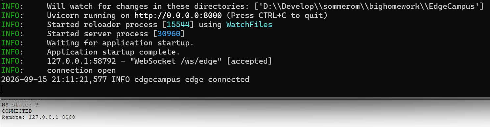
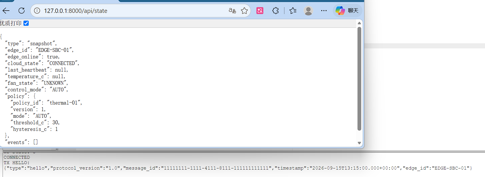
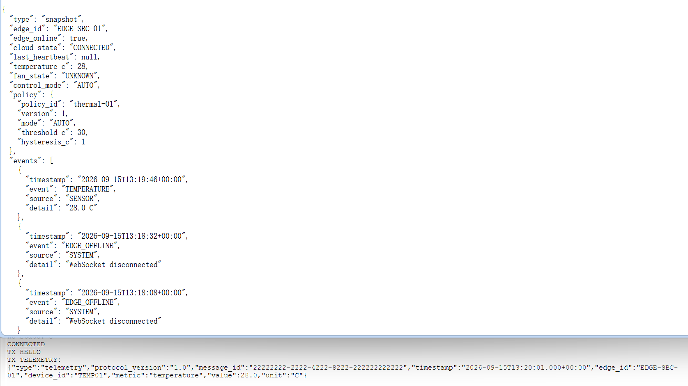
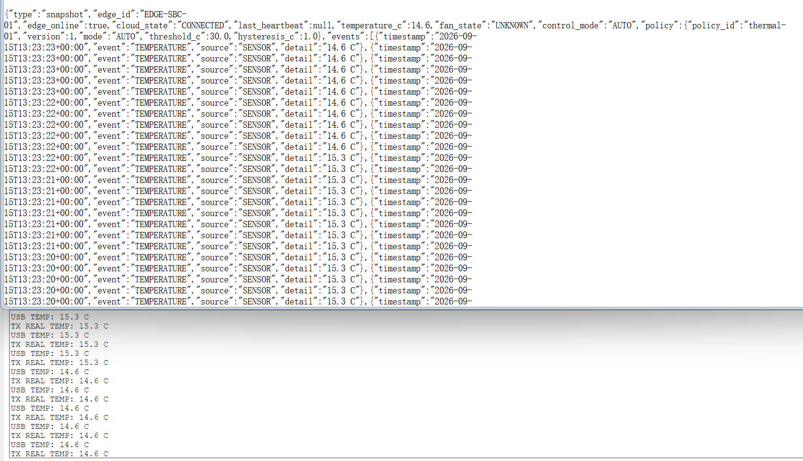
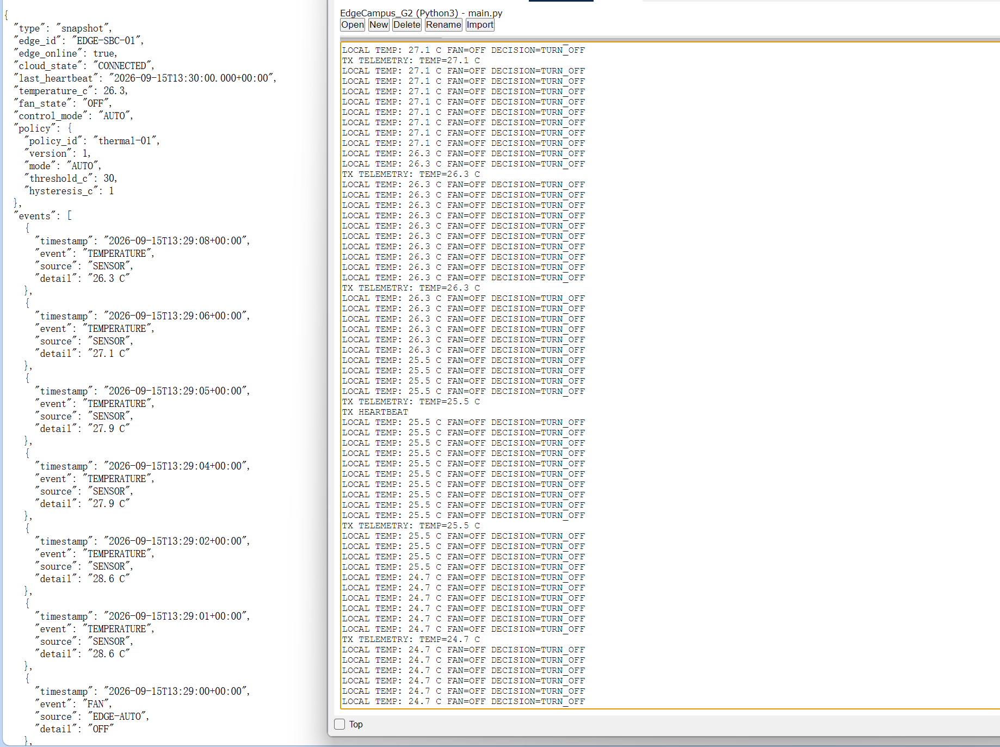
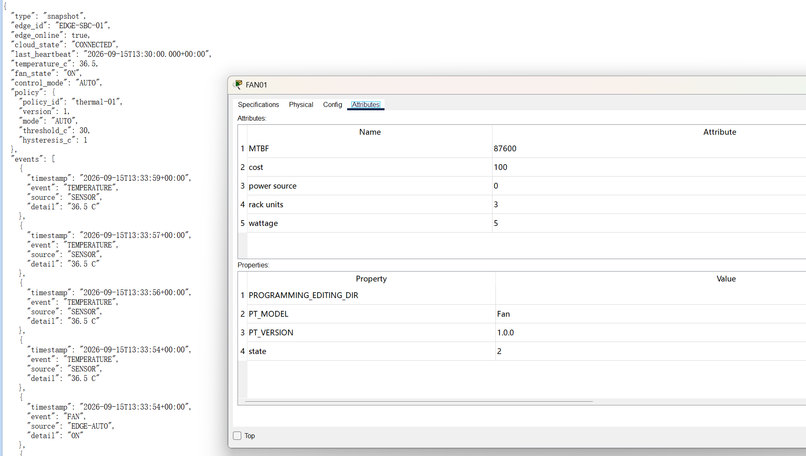

# Gate 2 — B Edge Owner 阶段实验报告

> 模块：B — Edge Owner
> 阶段：Gate 2 — Real Telemetry
> 环境：Cisco Packet Tracer 9.0.1
> 日期：2026-09-15
> B 模块结论：**PASS**
> 全局 Gate 2：**IN PROGRESS**

## 1. 阶段目标

Gate 1 已完成并验证本地闭环：

```text
TEMP01 → IO-MCU-01 → EDGE-SBC-01 → FAN01
```

Gate 2 在不破坏该 Local Loop 的前提下增加真实 Cloud Telemetry：

```text
                     ┌──→ FAN01
TEMP01 → MCU → SBC ──┤
                     └──→ RealWSClient → FastAPI Backend
```

核心原则是 **Local Loop 优先于 Cloud**。Cloud 或 WebSocket 异常不得导致本地温控停止。

## 2. 公共契约与真实性边界

本阶段保持 Protocol v1.0，不修改公共字段：

```text
ws://127.0.0.1:8000/ws/edge
edge_id  = EDGE-SBC-01
TEMP     = TEMP01
FAN      = FAN01
unit     = C
protocol = 1.0
```

FAN01 的 Packet Tracer 物理状态为 `0=OFF`、`1=LOW`、`2=HIGH`，Protocol 仍只使用 `OFF/ON`：

```text
Protocol OFF → PT state 0
Protocol ON  → PT state 2
```

真实控制通道为：

```text
TEMP01 → MCU → EDGE-SBC-01
  → Packet Tracer External Network Access / RealWSClient
  → ws://127.0.0.1:8000/ws/edge
  → Real FastAPI
```

RealWSClient 是带外 Edge–Cloud 通道，不经过 Packet Tracer VLAN、R-HQ、R-ISP、BGP、NAT 或 WAN。Packet Tracer WAN 是课程企业数据平面，两者不能混写。

## 3. Gate 1 基线保留

本阶段没有重写 Gate 1 AUTO 逻辑：

```text
mode = AUTO
threshold_c = 30.0
hysteresis_c = 1.0
policy_version = 1

temperature >= 30.0 → FAN ON
temperature <= 29.0 → FAN OFF
29.0 < temperature < 30.0 → HOLD previous state
```

物理连接保持：

```text
TEMP01 A0 → IO-MCU-01 A0 → MCU USB0 → SBC USB0 → SBC D0 → FAN01 D0
```

## 4. 实施与分层验证

为避免同时调试传感器、USB、WebSocket、JSON、Backend 和 FAN，本阶段逐层增加能力：

```text
RealWSClient 建连
→ Protocol hello
→ 固定值 Telemetry
→ 真实 TEMP01 Telemetry
→ Local Loop + Telemetry + Status + Heartbeat
→ 真实 FAN ON + Backend 状态同步
```

### 4.1 Backend 环境修复

启动 Backend 时首次出现：

```text
No module named uvicorn
```

原因是当前 `.venv` 尚未安装项目依赖。执行：

```powershell
python -m pip install -r requirements.txt
python -m uvicorn backend.app.main:app --reload --host 0.0.0.0 --port 8000
```

随后得到 `Application startup complete`，Backend 正常监听 `0.0.0.0:8000`。

### 4.2 RealWSClient 建连

SBC 使用 `RealWSClient()` 连接 `ws://127.0.0.1:8000/ws/edge`。实测 SBC 显示：

```text
WS state: 3
CONNECTED
Remote: 127.0.0.1 8000
```

Backend 同时显示：

```text
WebSocket /ws/edge [accepted]
connection open
edge connected
```

因此 Packet Tracer SBC 到真实 FastAPI 的 WebSocket 通道恢复成功。



### 4.3 合法 hello

连接成功后发送 Protocol v1.0 `hello`。Backend `/api/state` 实测：

```text
edge_id       = EDGE-SBC-01
edge_online   = true
cloud_state   = CONNECTED
temperature_c = null
fan_state     = UNKNOWN
```

此时只发送 hello，因此温度为 `null`、风扇为 `UNKNOWN` 符合分层测试预期。



### 4.4 固定值 Telemetry

为先排除 USB 与传感器影响，发送固定 `28.0 C`：

```json
{
  "type": "telemetry",
  "protocol_version": "1.0",
  "edge_id": "EDGE-SBC-01",
  "device_id": "TEMP01",
  "metric": "temperature",
  "value": 28.0,
  "unit": "C"
}
```

Backend `/api/state` 得到 `temperature_c = 28`，事件为 `TEMPERATURE / SENSOR / 28.0 C`，证明 SBC → Protocol v1.0 → Backend → SystemState 链路成立。



### 4.5 SuspensionError 与修复

第一次程序把 `delay(500)` 放入 `on_connection_change()` 回调，实际出现：

```text
SuspensionError:
Cannot call a function that blocks or suspends here
```

根因是 Packet Tracer RealWSClient callback 不允许执行阻塞或挂起函数。修复后 callback 只记录连接状态，所有 `delay()`、hello、telemetry、status 和 heartbeat 的发送节奏均移到主循环。修改后程序正常运行。

### 4.6 真实 TEMP01 Telemetry

固定值成功后，将数据源替换为 MCU USB 收到的真实温度：

```text
TEMP01 → MCU → USB → SBC → JSON → RealWSClient → Backend
```

SBC 实测：

```text
USB TEMP: 15.3 C
TX REAL TEMP: 15.3 C
USB TEMP: 14.6 C
TX REAL TEMP: 14.6 C
```

Backend 同步显示 `temperature_c = 14.6`，事件中同时出现 `15.3 C` 和 `14.6 C`。温度随 Packet Tracer 传感器连续变化，证明数据不是写死值。



## 5. Local Loop 与 Cloud 功能整合

最终控制器保留以下执行顺序：

```text
read USB
→ Local AUTO
→ FAN physical write
→ Cloud connected?
   ├─ YES: hello / telemetry / status / heartbeat
   └─ NO: Local Loop continues
```

Telemetry 约 1 秒一次，Heartbeat 约 5 秒一次。状态首次建连或 FAN 变化时发送，字段为：

```text
device_id = FAN01
value     = OFF / ON
source    = EDGE-AUTO
```

Heartbeat 保持：

```text
status         = ONLINE
mode           = AUTO
policy_version = 1
```

归档源码为 `edge/packet_tracer/sbc_gate2_controller.py`。Gate 1 的 `mcu_temperature_sender.py` 和 `sbc_local_controller.py` 未被修改。

## 6. 完整 Edge 状态验证 — OFF

整合后 SBC Console 同时出现本地控制、真实 telemetry 和 heartbeat：

```text
LOCAL TEMP: 27.1 C FAN=OFF DECISION=TURN_OFF
TX TELEMETRY: TEMP=27.1 C
LOCAL TEMP: 26.3 C FAN=OFF DECISION=TURN_OFF
TX TELEMETRY: TEMP=26.3 C
TX HEARTBEAT
```

Backend `/api/state`：

```text
edge_online    = true
cloud_state    = CONNECTED
last_heartbeat = non-null
temperature_c  = 26.3
fan_state      = OFF
control_mode   = AUTO
```

Events 存在 `FAN / EDGE-AUTO / OFF`，说明 Local Loop、Telemetry、FAN Status 与 Heartbeat 能在同一 Edge 程序中共同工作。



## 7. 真实高温 FAN ON 验证

当真实温度升至约 `36.5 C`、超过 `30.0 C` 阈值后，实测 Backend：

```text
edge_online    = true
cloud_state    = CONNECTED
temperature_c  = 36.5
fan_state      = ON
control_mode   = AUTO
```

Events 为 `FAN / EDGE-AUTO / ON`；Packet Tracer FAN01 Attributes 同时显示 `state = 2`。完整链路为：

```text
TEMP01 = 36.5 C → MCU / USB → SBC Local AUTO
  ├─ customWrite(0, "2") → FAN01 state=2
  └─ Protocol status value=ON → Backend fan_state=ON
```

这同时证明真实温度进入 Edge、本地 AUTO 正确决策、物理执行器开启、Protocol 使用 `ON` 而不是数字 `2`，且 Backend 同步了 Edge 实际状态。



## 8. Screenshot / Evidence 索引

| 编号 | 文件 | 证明内容 |
|---|---|---|
| B-G2-01 | `B-G2-01-realws-connected.png` | RealWSClient 与真实 Backend 建连 |
| B-G2-02 | `B-G2-02-hello-state.png` | hello 被 Backend 接收，Edge Online |
| B-G2-03 | `B-G2-03-fixed-telemetry.png` | 固定 28 C Telemetry 成功 |
| B-G2-04 | `B-G2-04-real-temp-telemetry.png` | 真实 TEMP01 → Backend |
| B-G2-05 | `B-G2-05-full-edge-state-off.png` | Local Loop + Telemetry + Status + Heartbeat，OFF |
| B-G2-06 | `B-G2-06-real-fan-on-status.png` | 真实高温 → PT state 2 + Protocol ON |

证据目录：`edge/packet_tracer/evidence/gate2/`。

## 9. Gate 2 B 验收结果

| 验收项 | 结果 | 证据 |
|---|---|---|
| RealWSClient → `/ws/edge` | PASS | B-G2-01 |
| Protocol v1.0 hello | PASS | B-G2-02 |
| 合法固定 Telemetry | PASS | B-G2-03 |
| Telemetry 来自真实 TEMP01 | PASS | B-G2-04 |
| Backend `temperature_c` 更新 | PASS | B-G2-04/B-G2-05 |
| Local AUTO 保持 | PASS | B-G2-05/B-G2-06 |
| FAN Protocol Status | PASS | B-G2-05/B-G2-06 |
| `source = EDGE-AUTO` | PASS | B-G2-05/B-G2-06 |
| PT state 2 ↔ Protocol ON | PASS | B-G2-06 |
| Heartbeat | PASS | B-G2-05 |
| Public Contract 未修改 | PASS | 全过程 |
| Gate 1 Local Loop 被保留 | PASS | B-G2-05/B-G2-06 |

## 10. Cloud Failure 边界

Gate 1 已有 Backend-off 直接证据：`TcpTestSucceeded : False` 时本地 `TEMP → AUTO → FAN` 仍工作。Gate 2 控制器仍把本地读取、决策和执行放在 Cloud 判断之前，因此 Cloud 不会成为本地路径的前置条件。

完整的 Cloud-off → reconnect → state_sync 正式故障恢复属于 Gate 4，本阶段不提前混入。

## 11. 日志刷新频率

整合版本主循环检查 USB 较频繁，因此 Console 会出现大量 `LOCAL TEMP ...`。这是日志频率现象，不是传感器或控制逻辑异常。Telemetry 与 Heartbeat 已分别节流至约 1 秒和约 5 秒；后续演示可减少重复日志，但不改变 Gate 2 控制语义。

## 12. 结论与下一阶段

本阶段已从 Gate 1 的真实传感器 → Local Edge → 真实执行器，升级为：

```text
                       ┌──→ FAN01 physical actuator
TEMP01 → MCU → SBC ────┤
                       └──→ Protocol v1.0 → RealWSClient → Backend
```

RealWSClient、hello、固定值 telemetry、真实 TEMP01 telemetry、Local AUTO、status、heartbeat 和真实 FAN state 2 均已获得实验证据，且未发生字段、ID、单位或 FAN 状态语义漂移。

```text
B — Edge Owner
Gate 2 Edge-side deliverable: PASS

Global Gate 2: IN PROGRESS
```

全局 Gate 2 仍等待：C 的 Backend 正式验收、D 的真实 TEMP→Dashboard 联调，以及 A 的 Branch LAN + IPv4 WAN Underlay。Gate 3 才进入 Policy / Command / ACK；开始 Gate 3 前不得破坏本阶段已验证的 Local Loop + Telemetry 主路径。
