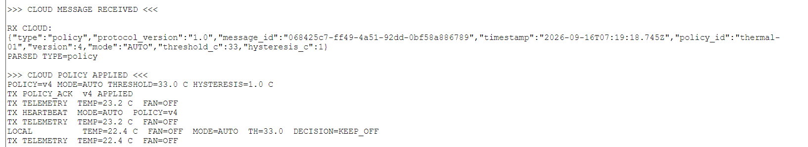
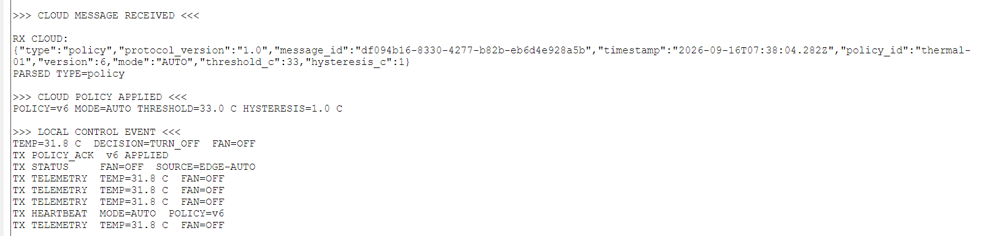
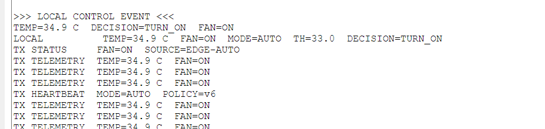
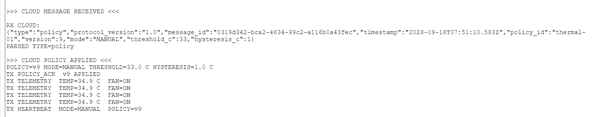
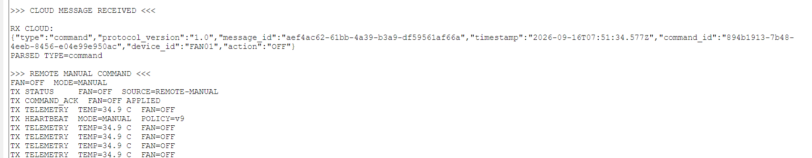
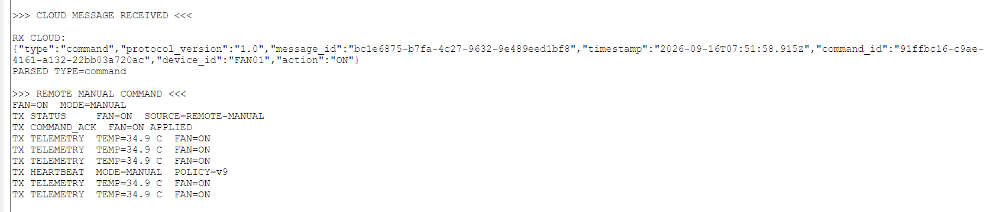
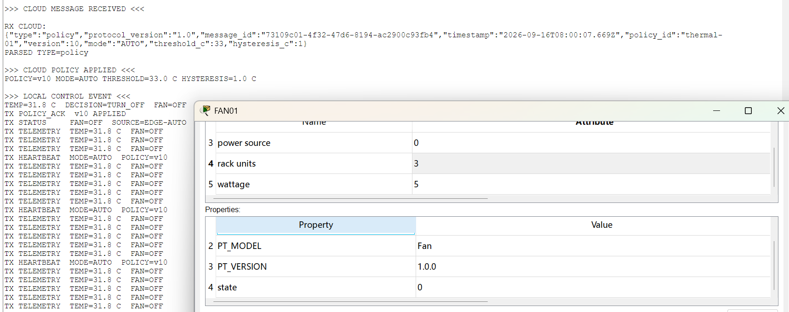

# Gate 3 — B Edge Owner 阶段实验报告

> 模块：B — Edge Owner
> 阶段：Gate 3 — Real Policy / Command Loop
> 环境：Cisco Packet Tracer 9.0.1
> 日期：2026-09-16
> B 模块结论：**PASS LOCALLY / READY FOR B+C+D INTEGRATION**
> 全局 Gate 3：**IN PROGRESS**

## 1. 阶段目标

Gate 2 已完成真实上行链路：

```text
TEMP01 → IO-MCU-01 → EDGE-SBC-01
  ├─→ FAN01
  └─→ RealWSClient → FastAPI Backend → Dashboard
```

Gate 3 在不破坏 Gate 2 Local Loop、Telemetry、Status 与 Heartbeat 的前提下，增加真实 Cloud → Edge 下行控制：

```text
Dashboard
  ↓ Policy / Command
Backend
  ↓
RealWSClient
  ↓
EDGE-SBC-01
  ├─→ 运行时 Policy
  ├─→ FAN01
  ├─→ policy_ack
  └─→ command_ack
```

B 本阶段目标是完成真实 Packet Tracer Edge 对 `policy` 与 `command` 的接收、校验、应用和 ACK，并保持 Local Loop 优先于 Cloud transport。

## 2. 公共契约与真实性边界

本阶段继续保持 Protocol v1.0，不修改 `docs/PROTOCOL.md`：

```text
Edge WS     = /ws/edge
edge_id     = EDGE-SBC-01
temperature = TEMP01
fan         = FAN01
unit        = C
policy_id   = thermal-01
fan state   = ON / OFF
```

Policy 使用既有字段：`policy_id / version / mode / threshold_c / hysteresis_c`；Command 使用 `command_id / device_id / action`；Edge 返回 `policy_ack / command_ack / status`。

`REMOTE-MANUAL` 与 `EDGE-AUTO` 仅作为既有合法 `status.source` 使用。

真实 WebSocket 仍是 Packet Tracer External Network Access / RealWSClient → 本机 FastAPI 的带外控制通道，不经过 Packet Tracer WAN、BGP、NAT 或企业 VLAN 数据平面。

## 3. Gate 2 基线保留

Gate 3 以 Gate 2 已验证控制器为基线，物理链路保持：

```text
TEMP01 A0 → IO-MCU-01 A0
IO-MCU-01 USB0 → EDGE-SBC-01 USB0
EDGE-SBC-01 D0 → FAN01 D0
```

Gate 2 默认策略：

```text
mode = AUTO
threshold_c = 30.0
hysteresis_c = 1.0
policy_version = 1
```

Gate 3 将其升级为运行时策略状态，使 Cloud Policy 能改变 Edge 的本地 AUTO 行为。

## 4. Gate 3 控制器设计

归档源码：

```text
edge/packet_tracer/sbc_gate3_controller.py
```

主循环顺序：

```text
1. 读取真实 USB 温度
2. 执行本地控制
3. 处理 Cloud 下行队列
4. 发送 Telemetry / Status / Heartbeat
```

RealWSClient callback 只负责把收到的消息放入 `pending_messages`，不调用 `delay()`，不执行长逻辑，继续规避 Gate 2 已实测的 Packet Tracer `SuspensionError`。

为降低 Packet Tracer Python 环境兼容性风险，控制器针对冻结的 Protocol v1.0 平坦 `policy` / `command` 消息提取字段，并校验：

```text
protocol_version == 1.0
policy_id == thermal-01
mode ∈ {AUTO, MANUAL}
0 <= threshold_c <= 80
0 <= hysteresis_c <= 10
device_id == FAN01
action ∈ {ON, OFF}
```

Policy 还要求：

```text
new_version > current POLICY_VERSION
```

旧版本不会覆盖当前运行时策略。

## 5. Policy 下行与应用

Dashboard / Backend 下发 `AUTO / threshold=33 / hysteresis=1` 后，真实 SBC 收到并解析 `policy`，随后更新：

```text
MODE
THRESHOLD_C
HYSTERESIS_C
POLICY_VERSION
```

实测 Console 出现：

```text
>>> CLOUD POLICY APPLIED <<<
POLICY=vN MODE=AUTO THRESHOLD=33.0 C HYSTERESIS=1.0 C

TX POLICY_ACK vN APPLIED
TX HEARTBEAT MODE=AUTO POLICY=vN
```

这证明 Edge 不只是收到 Policy，而是已写入运行时策略并在成功应用后返回 ACK。



## 6. 新 Policy 对真实 Local Loop 的影响

Gate 3 核心 Policy：

```text
AUTO
threshold = 33.0 C
hysteresis = 1.0 C
```

对应逻辑：

```text
T >= 33.0       → FAN ON
T <= 32.0       → FAN OFF
32.0 < T < 33.0 → HOLD
```

### 6.1 低温侧 — FAN OFF

为得到稳定可重复的 Packet Tracer 环境，本次测试将 Environment 中 Ambient Temperature 的 transfer rate 归零，避免环境曲线持续漂移影响验收。

真实温度稳定在约 `31.8 C` 时：

```text
TEMP=31.8 C
DECISION=TURN_OFF
FAN=OFF
MODE=AUTO
TH=33.0
```

符合 `T <= threshold - hysteresis` 的 OFF 条件。



### 6.2 高温侧 — FAN ON

真实温度提高至约 `34.9 C`：

```text
TEMP=34.9 C
DECISION=TURN_ON
FAN=ON
MODE=AUTO
TH=33.0
```

同时发送：

```text
TX STATUS FAN=ON SOURCE=EDGE-AUTO
TX TELEMETRY TEMP=34.9 C FAN=ON
TX HEARTBEAT MODE=AUTO POLICY=vN
```

证明 Cloud Policy 已真正改变本地物理控制行为，而非只改变 Dashboard 显示值。



## 7. MANUAL Policy

随后下发 MANUAL Policy：

```text
mode = MANUAL
threshold = 33
hysteresis = 1
```

真实 Edge 显示：

```text
>>> CLOUD POLICY APPLIED <<<
POLICY=vN MODE=MANUAL THRESHOLD=33.0 C HYSTERESIS=1.0 C

TX POLICY_ACK vN APPLIED
TX HEARTBEAT MODE=MANUAL POLICY=vN
```

MANUAL 模式下真实温度仍持续采集和 Telemetry，但本地温度不再自动覆盖远程 FAN Command。



## 8. Remote FAN Command

### 8.1 高温下远程 OFF

测试时真实温度保持约 `34.9 C`，明显高于 AUTO 阈值 33 C。MANUAL 模式下下发：

```text
device_id = FAN01
action = OFF
```

SBC 实测：

```text
>>> REMOTE MANUAL COMMAND <<<
FAN=OFF MODE=MANUAL

TX STATUS FAN=OFF SOURCE=REMOTE-MANUAL
TX COMMAND_ACK FAN=OFF APPLIED
TX TELEMETRY TEMP=34.9 C FAN=OFF
TX HEARTBEAT MODE=MANUAL POLICY=vN
```

由于温度仍高于 33 C 而 FAN 能持续保持 OFF，该证据能够明确区分 MANUAL Command 与 AUTO 温控。



### 8.2 远程 ON

继续下发：

```text
device_id = FAN01
action = ON
```

实测：

```text
>>> REMOTE MANUAL COMMAND <<<
FAN=ON MODE=MANUAL

TX STATUS FAN=ON SOURCE=REMOTE-MANUAL
TX COMMAND_ACK FAN=ON APPLIED
TX TELEMETRY TEMP=34.9 C FAN=ON
```

说明远程命令能够真实写入 FAN01，并在执行后返回合法 ACK。



## 9. 调试过程与问题处理

### 9.1 Dashboard 编辑态被 snapshot 覆盖

联调过程中发现 Dashboard 持续接收 snapshot 时会把 Policy 表单重新写成 Backend 当前值，导致用户刚选择的 MANUAL 或输入的 threshold 可能在提交前跳回旧值。

该问题属于 Dashboard Owner 范围，不在 B Edge 中通过修改协议规避。一次 MANUAL 测试中因提交前界面回到 AUTO，远程 OFF 后立即被高温 AUTO 再次开启；检查 Console 后确认实际收到的是 `mode=AUTO`。重新下发真正的 `mode=MANUAL` 后，Command OFF/ON 均稳定通过。

该现象也反向验证了 SBC 对 AUTO/MANUAL 的语义区分是有效的。

### 9.2 Packet Tracer Ambient Temperature 持续漂移

Environment 中存在非零 `transfer rate`，导致即使 keyframe value 已设置，`current` 温度仍持续变化。为获得可重复验收，测试环境将 transfer rate 归零，使 31.8 C / 34.9 C 两侧测试稳定复现。

## 10. Gate 2 Regression

完成 Policy / Command 后重新切回：

```text
MODE=AUTO
threshold=33
hysteresis=1
```

并从 FAN ON 状态将真实温度降至约 `31.8 C`。

SBC 实测：

```text
>>> CLOUD POLICY APPLIED <<<
MODE=AUTO THRESHOLD=33.0 C HYSTERESIS=1.0 C

>>> LOCAL CONTROL EVENT <<<
TEMP=31.8 C DECISION=TURN_OFF FAN=OFF

TX POLICY_ACK ... APPLIED
TX STATUS FAN=OFF SOURCE=EDGE-AUTO
TX TELEMETRY TEMP=31.8 C FAN=OFF
TX HEARTBEAT MODE=AUTO POLICY=vN
```

FAN01 Attributes 同时显示：

```text
state = 0
```

因此 Gate 3 新增下行功能没有破坏 Gate 2 的真实传感器、Local AUTO、物理 FAN、Status、Telemetry 与 Heartbeat。



## 11. Evidence 索引

| 编号 | 文件 | 证明内容 |
|---|---|---|
| G3-B-01 | `G3-B-01-policy-apply-ack-pass.png` | Policy 收到、运行时应用、`policy_ack` |
| G3-B-02 | `G3-B-02-auto-low-temp-off-pass.png` | threshold=33 时低温侧 FAN OFF |
| G3-B-03 | `G3-B-03-auto-high-temp-on-pass.png` | threshold=33 时高温侧 FAN ON |
| G3-B-04 | `G3-B-04-manual-policy-apply-pass.png` | MANUAL Policy 应用与 ACK |
| G3-B-05 | `G3-B-05-manual-command-off-pass.png` | 高温下远程 OFF、`REMOTE-MANUAL`、`command_ack` |
| G3-B-06 | `G3-B-06-manual-command-on-pass.png` | 远程 ON、`REMOTE-MANUAL`、`command_ack` |
| G3-B-07 | `G3-B-07-gate2-regression-auto-pass.png` | 切回 AUTO 后 Gate 2 全链路回归 + FAN state 0 |

证据目录：

```text
edge/packet_tracer/evidence/gate3/
```

## 12. B Gate 3 验收结果

| 验收项 | 结果 | 证据 |
|---|---|---|
| RealWSClient 接收真实 Cloud 下行 | PASS | G3-B-01 |
| Policy Protocol v1.0 字段解析 | PASS | G3-B-01 |
| Policy version 严格递增 | PASS | 控制器实现 + 多版本实测 |
| 运行时 AUTO threshold 更新 | PASS | G3-B-01/G3-B-02/G3-B-03 |
| `policy_ack APPLIED` | PASS | G3-B-01/G3-B-04 |
| threshold=33 低温侧 OFF | PASS | G3-B-02 |
| threshold=33 高温侧 ON | PASS | G3-B-03 |
| MANUAL Policy | PASS | G3-B-04 |
| FAN OFF Command | PASS | G3-B-05 |
| FAN ON Command | PASS | G3-B-06 |
| `status.source=REMOTE-MANUAL` | PASS | G3-B-05/G3-B-06 |
| `command_ack APPLIED` | PASS | G3-B-05/G3-B-06 |
| Gate 2 Telemetry / Status / Heartbeat / Local AUTO 回归 | PASS | G3-B-07 |
| Public Contract 漂移 | NONE | 全过程 |

## 13. 当前边界与联调点

B 已完成真实 Packet Tracer Edge 侧 Gate 3 能力：

```text
Policy receive
→ validate
→ runtime apply
→ local behavior changes
→ policy_ack

Command receive
→ real FAN write
→ REMOTE-MANUAL status
→ command_ack
```

当前状态：

```text
B Gate 3 Edge implementation:
PASS LOCALLY / READY FOR B+C+D INTEGRATION

B+C+D Gate 3 end-to-end:
PENDING FORMAL INTEGRATION
```

下一步由 B/C/D 在同一集成环境中验证：

```text
Dashboard
→ Backend
→ Real PT Edge
→ policy_ack / command_ack
→ Backend
→ Dashboard Event / ACK display
```

正式 Cloud-off → reconnect → state_sync 仍属于 Gate 4，不在本阶段提前宣称完成。

## 14. 结论

Gate 3 B 模块已经从 Gate 2 的“真实上行 Telemetry Source + Local AUTO”升级为可接收 Cloud 下行控制的真实 Edge：

```text
                    Cloud Policy / Command
                             ↓
TEMP01 → MCU → EDGE-SBC-01 ← RealWSClient
                  │
                  ├─ Runtime AUTO / MANUAL Policy
                  ├─ FAN01 physical control
                  ├─ Telemetry / Status / Heartbeat
                  ├─ policy_ack
                  └─ command_ack
```

真实测试已经覆盖 Policy 33 C 动态阈值、低温 OFF、高温 ON、MANUAL Policy、远程 FAN OFF/ON、ACK、`REMOTE-MANUAL` 以及 Gate 2 全链路回归。

本阶段未修改 Protocol v1.0，也未把 Packet Tracer WAN 描述为 RealWSClient 数据路径。

```text
B — Edge Owner
Gate 3 Edge-side deliverable:
PASS LOCALLY / READY FOR B+C+D INTEGRATION

Global Gate 3:
IN PROGRESS
```
