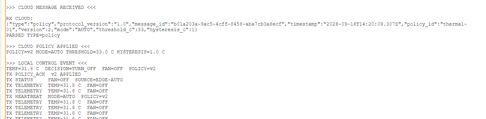
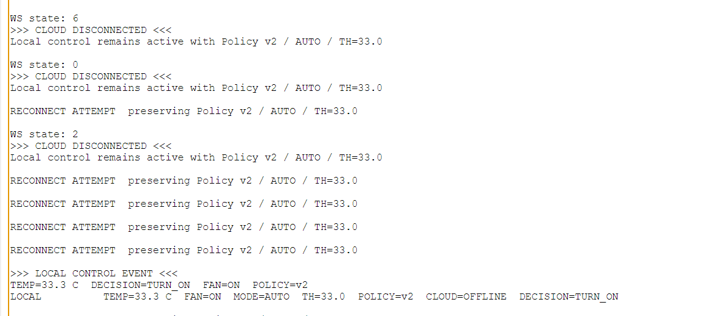
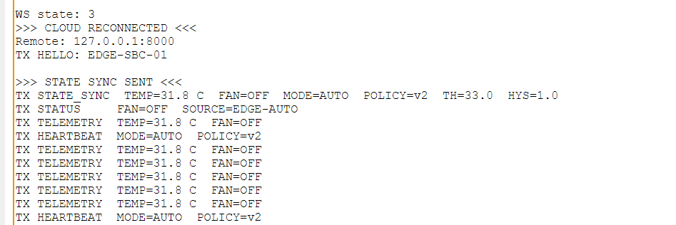

# Gate 4 — B Edge 断云自治与恢复报告

日期：2026-09-17；Cisco Packet Tracer 9.0.1。实测源码：`edge/packet_tracer/sbc_gate4_controller.py`。结论：真实离线 ON 与 reconnect/state_sync 有截图；离线降温 OFF/物理 Attributes 待补归档。

## 目标与设计

Cloud outage 时 Edge 进程继续读取 TEMP01 USB、按最后有效 AUTO Policy 控 FAN01。主循环先本地控制，再下行队列、重连和上行；callback 记录连接状态与入队，无 delay。重连间隔 2000 ms（循环累计计时，非精确墙钟 SLA），main 的 connection_ready 声明 global 并与 client.connected() 同步。

断云不重置 MODE/THRESHOLD_C/HYSTERESIS_C/POLICY_VERSION。fresh connection 重置 hello/state_sync 发送标记，有真实温度后才发送包含真实 temperature_c、ON/OFF fan_state 和完整最后有效 Policy 的 state_sync。协议仍 1.0、/ws/edge、EDGE-SBC-01/TEMP01/FAN01；物理 OFF→0、ON→2。RealWSClient 是宿主机带外通道，不经 PT WAN/BGP/NAT/VLAN。

## 实际测试与证据

1. 下发 AUTO/v2/33 C/hysteresis=1，31.8 C→TURN_OFF，policy_ack APPLIED，heartbeat v2。

2. 停止 Backend，Edge 始终运行。截图显示 CLOUD DISCONNECTED、重连尝试保留 v2/33；升到 33.3 C 时 CLOUD=OFFLINE、TURN_ON/FAN=ON。证明离线真实温度仍进入本地控制。

3. 重启 Backend，不重启 Edge。自动 CLOUD RECONNECTED→hello→state_sync，31.8 C/OFF/AUTO/v2/33/1，上行 status/telemetry/heartbeat 恢复。

用户说明离线升降温与真实 FAN 动作均已测试。但现有离线图只直接覆盖 ON；恢复图的 OFF 不能单独证明“离线降温期间”的 TURN_OFF。后补离线 OFF 与 FAN Attributes，详见 EVIDENCE_INDEX。

## 调试问题与边界

Cloud outage 与 Edge process restart 不同：前者保留内存策略；停止/重启 Edge Python 会回到源码默认 v1/30，不是本 Gate 的 Policy persistence 场景。本次没有加入进程重启持久化功能。

固定 ISO timestamp 与 UUID-shaped counter message_id 保留 PT 实测兼容实现；主机只做编译，不能 import/run gpio/usb/realhttp 控制器。发送与 connect API 的 PT 行为以现场实测为准，不把源码调度设计夸大为所有网络异常下的性能证明。
