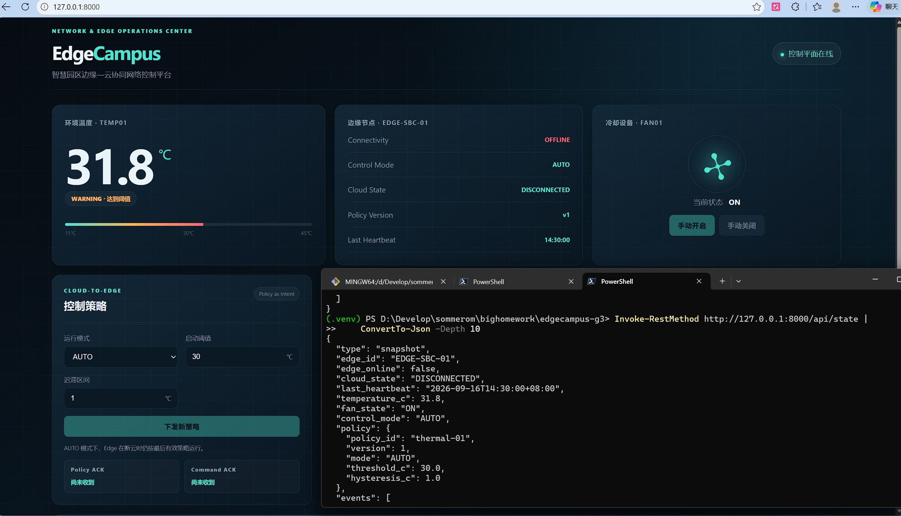
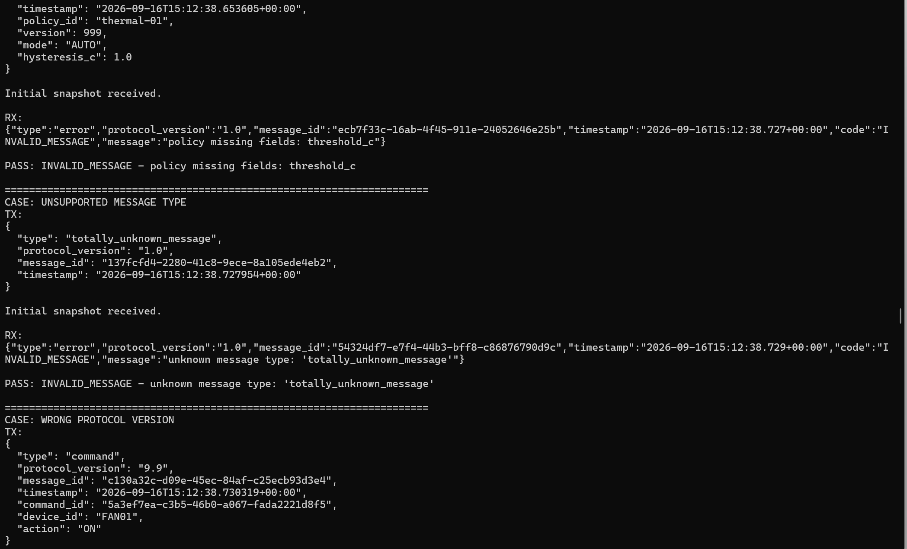
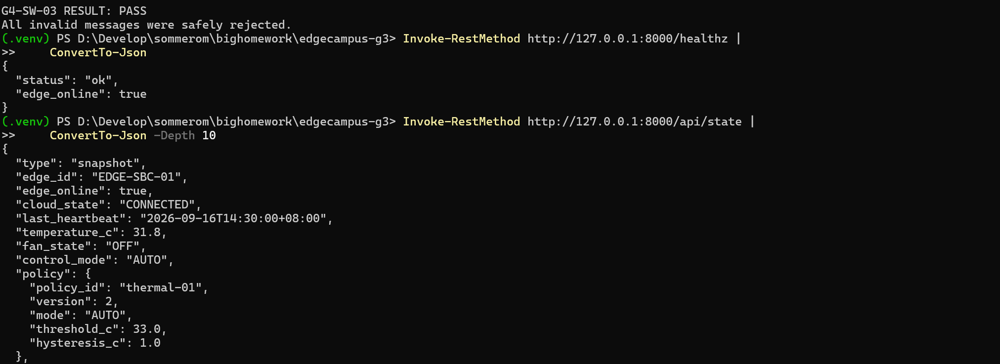
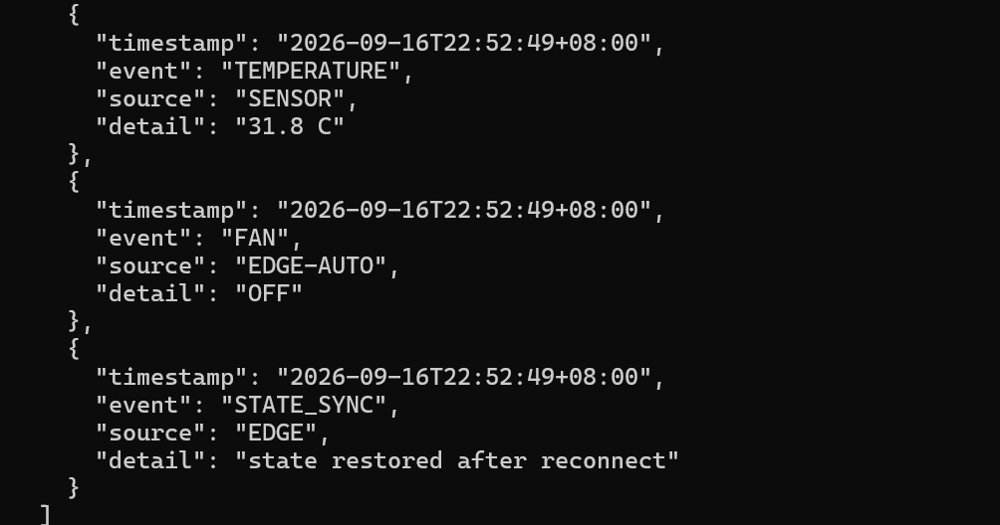
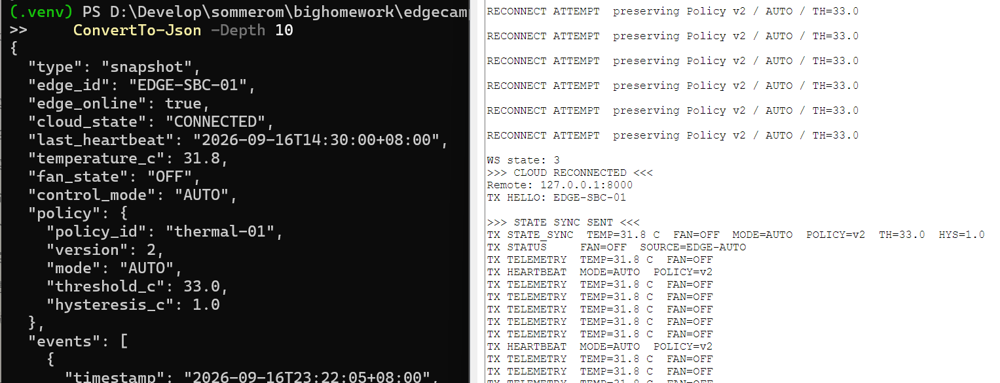

# Gate 4 — C Control Plane 稳定性与状态恢复报告

日期：2026-09-17。结论：三项 Gate1 stability debt 在 Gate4 有真实截图支撑并清零；当前审计补强需以本次自动测试结果为准。

## 目标、实现与恢复语义

backend/app/protocol.py 维持 Protocol 1.0，要求非空 message_id/timestamp、已支持 type；Policy 数值排除 bool，state_sync 要求 numeric/non-bool temperature、ON/OFF fan、object policy、thermal-01、正整数 version、合法 mode/threshold/hysteresis。

本次审计发现 type/mode/fan 等容器值可能导致 set membership TypeError，以及嵌套 policy_id 没有校验；以最小改动安全拒绝。main.py 现捕获非法 JSON 文本并返回 INVALID_MESSAGE。未改变字段、ID 或 URL。未承诺 timestamp 已校验 ISO 语法或 message_id 已验证 UUID 格式：当前仅检查非空字符串。

SystemState 新进程的 v1/30 是 Edge 尚未同步前临时默认值。state_sync 将 temperature_c、fan_state、deepcopy(policy)、control_mode 覆盖为 Edge 实际状态，并发 STATE_SYNC / EDGE / state restored after reconnect；不要求用户再发 Policy。测试验证恢复后策略独立拷贝。

## 真实测试与债务清零

- Edge 单独断开，Backend 仍运行：/api/state edge_online=false、DISCONNECTED，Dashboard OFFLINE。用于 disconnect debt；图中 v1 不作为非默认策略保留证据。

- 缺 threshold_c、未知 type：均返回 INVALID_MESSAGE。

- 测试脚本最终 all invalid PASS，包括 wrong-version；healthz ok，恢复 state v2/33/31.8/OFF。该汇总图包含结果，不把它当作 wrong-version 响应正文截图。

- 重连后 Backend 有 STATE_SYNC 事件；与真实 Edge reconnect 和恢复 /api/state 同屏交叉验证，v2/33 未回退。

三项债务：非法消息拒绝、disconnect→offline、reconnect+state_sync 均有上述证据；不将“单独停 Edge”误作 Gate4 内存 Policy 保留实验。

## 审计验证

gate4_invalid_ws_test.py 现严格检查 error/INVALID_MESSAGE 并失败返回非零；不是收到任意 error 就 PASS。新增 test_gate4_stability.py 覆盖非法容器/空信封/bool/嵌套 Policy/恢复与 deep copy。自动结果见 VALIDATION_REPORT.md。自动 WS 使用主机替身，不能代替 PT 实测。
