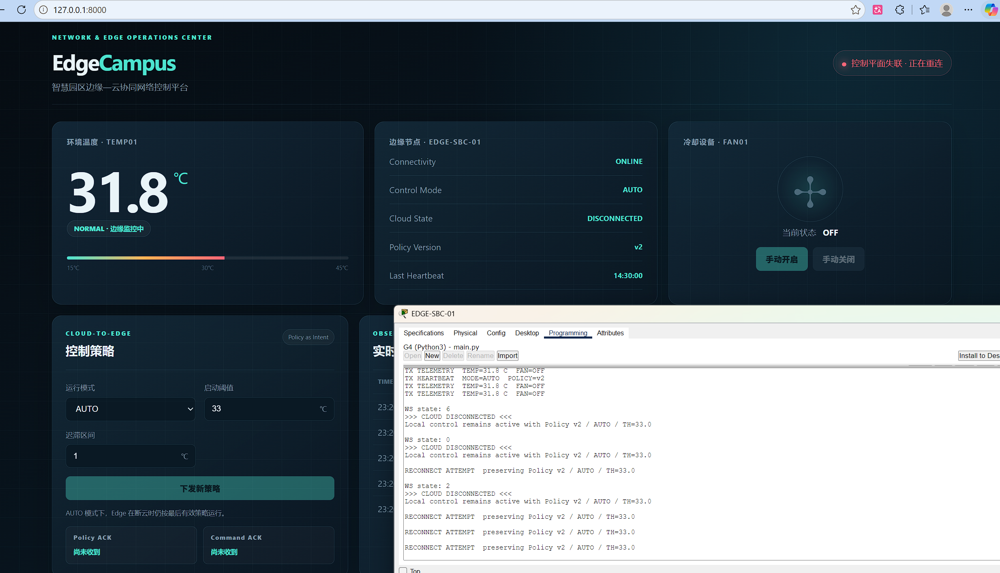

# Gate 4 — D Dashboard 失联与恢复报告

日期：2026-09-17。状态：失联 UI 有真实截图；恢复 UI 用户报告已测，截图后补。

## 目标与设计

dashboard/app.js 的 socket.onclose 显示“控制平面失联 · 正在重连”、Cloud DISCONNECTED、禁用控制按钮，并于 1800 ms 后重连。onopen 不立即启用按钮，等 Backend snapshot 确认 Edge 在线。render 使用真实 snapshot 更新温度/FAN/Policy/version、Edge offline 时禁用控制。

保留 Gate3 ACK 行为及 policyFormDirty 草稿保护；envelope("policy"、if (policyFormDirty) return;、input listener 和 temperature >= state.policy.threshold_c literal token 不做无意义格式化。恢复卡片使用真实 snapshot；用户编辑中的表单草稿仍按既有保护逻辑保留，不声称强制覆盖未提交草稿。

## 实际失联测试

Backend down，截图显示控制平面失联/正在重连、Cloud DISCONNECTED，最后已知 v2/33/31.8/OFF；Edge console 重连尝试继续保留 v2。

截图仍显示 Edge ONLINE 是最后已知 snapshot，不证明断云期间实时 Edge 在线；源码明确禁用按钮。截图视觉样式本身不足以验证 DOM disabled，自动测试应验证实际属性。

## 恢复与缺证

用户说明无需刷新、无需再发 Policy 自动恢复；现有 G4-C-05 只证明 Backend 与 Edge 恢复，不含恢复后的 Dashboard。G4-D-02-dashboard-recovery-pass.png 为 EVIDENCE_INDEX 中待补清单，不创建伪造 PNG。Global R2 Dashboard 验收归档尚未完整。自动 ACK 回归见 VALIDATION_REPORT。

## 2026-09-19 最终 D 证据收尾

本报告正文保留 2026-09-17 的历史事实，不回写当时尚未取得的截图。最终报告阶段已补齐 D01–D13（13/13），归档于 `evidence/final_report/D/`。

其中与 Gate4 恢复相关的新增最终证据为：

- `U10-cloud-ws-failure.png`：Cloud OFFLINE，本地自治模式；
- `U10-cloud-ws-local-fan.png`：CLOUD OFFLINE 下 TEMP=33.3 C、TURN_ON、FAN ON，物理 FAN state=2；
- `U10-cloud-ws-restored.png`：CLOUD RECONNECTED、STATE_SYNC 与 Dashboard SUCCESS 同屏。

因此本页“恢复 UI 截图后补”仅代表 2026-09-17 的历史状态；当前 D 最终证据已闭环。完整索引见 `../final/EVIDENCE_PENDING.md`。
